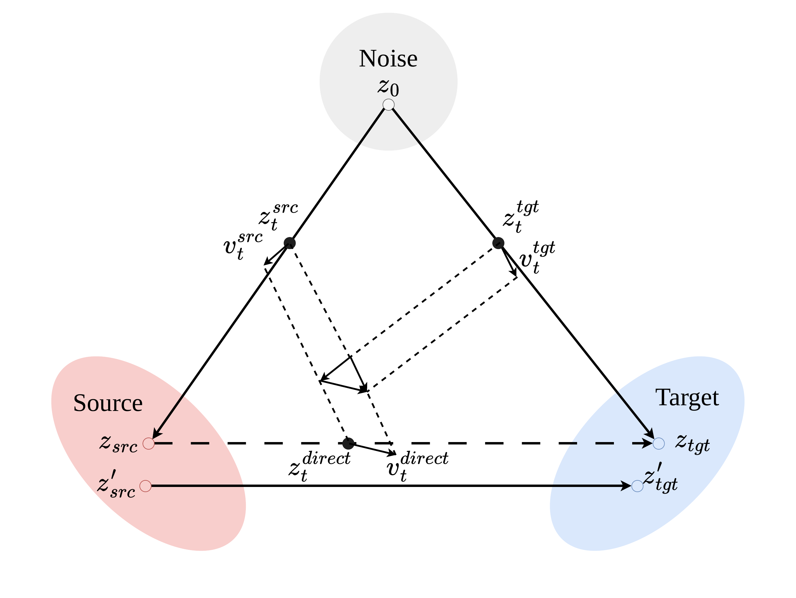

# Consistent Feature Transport for Image Relighting

<p align="center">
  Bohan Zhang<sup>1,&dagger;</sup>, Huanwei Liang<sup>2,&dagger;</sup>, Yuhan He<sup>2</sup>, Hongteng Xu<sup>3</sup>, Xiaochao Qu<sup>2</sup>, Luoqi Liu<sup>2</sup>, Dixin Luo<sup>1,&ast;</sup>, Ting Liu<sup>2,&ast;</sup>
</p>

<p align="center">
  <sup>1</sup>Beijing Institute of Technology &nbsp;&nbsp; <sup>2</sup>MT Lab, Meitu Inc. &nbsp;&nbsp; <sup>3</sup>Renmin University of China
</p>

<p align="center">
  <sup>&dagger;</sup>Equal contribution &nbsp;&nbsp; <sup>&ast;</sup>Corresponding author
</p>

<p align="center">
  <a href="https://arxiv.org/abs/2607.17833">Paper</a> &nbsp;·&nbsp; <a href="https://pan.baidu.com/s/11o0MhcXS6bZiKH17xAYa1g?pwd=t6p3">Dataset</a>
</p>

## Abstract

Image relighting modifies illumination while preserving non-lighting content such as identity and geometry. Existing diffusion-based methods often suffer from unstable illumination changes or inconsistent content preservation under complex lighting, as they lack an explicit mechanism to learn feature transformations between images. We reformulate relighting as an illumination feature transport problem and introduce **Consistent Feature Transport (CFT)**, a training principle that explicitly enforces illumination-consistent transport between source and target image distributions. Built upon rectified flow, CFT jointly models noise-to-image generation and illumination-consistent source-to-target transport through trajectory-level supervision. This dual-transport formulation encourages isolation of illumination-specific variations while preserving content-aligned features. To support complex lighting scenarios, we construct a large-scale portrait relighting dataset with diverse relighting effects. Experiments show consistent improvements over existing state-of-the-art relighting approaches and demonstrate that CFT can generalize to other editing tasks, including style transfer.

## Method

<p align="center">
  
</p>

## Installation

Use Python 3.10 and a CUDA-enabled environment. Install the dependencies from the repository root:

```bash
python -m pip install -r requirements.txt
```

The requirements retain the original versions, including PyTorch 2.6.0, Transformers 4.57.1, and the Diffusers commit used by the training code. Git is required to install Diffusers.

Download the base models and set their local paths in the training scripts:

- [FLUX.1-Kontext-dev](https://huggingface.co/black-forest-labs/FLUX.1-Kontext-dev): `/path/to/FLUX.1-Kontext-dev`
- [Qwen-Image-Edit-2509](https://huggingface.co/Qwen/Qwen-Image-Edit-2509): `/path/to/Qwen-Image-Edit-2509`

Keep the complete Diffusers model directory, including its model, tokenizer, processor where applicable, and scheduler subfolders. Follow each base model's access and license terms.

## Data Format

Training uses an existing JSONL file with one source image, target image, and lighting instruction per line:

```jsonl
{"source": "source/001.png", "target": "target/001.png", "text": "Add warm light from the left."}
{"source": "source/002.png", "target": "target/002.png", "text": "Add warm light from the left."}
```

Set `--dataset_root_path` to the image root directory. Both training loaders resolve image paths against this directory. Flux receives the JSONL path through `--jsonl_for_train`; Qwen uses `--train_data_dir`.

Both models also require an existing reference-group JSON file through `--json_for_ref`. Its keys are the training text with leading and trailing whitespace removed; each value contains image pairs sharing that condition:

```json
{
  "Add warm light from the left.": [
    {"source": "source/001.png", "target": "target/001.png", "text": "Add warm light from the left."},
    {"source": "source/002.png", "target": "target/002.png", "text": "Add warm light from the left."}
  ]
}
```

Reference images use the same dataset root. Each training condition must have a reference pair with a different `source` path from the current sample. Reference groups should contain training samples only.

For inference, provide a test JSONL with `source`, `text`, and optionally `target`:

```jsonl
{"source": "/path/to/source/001.png", "target": "/path/to/target/001.png", "text": "Add warm light from the left."}
```

Inference reads `source` directly, so use absolute paths or paths relative to the repository root. It does not read the target image: `target` supplies the output filename, falling back to `source` when absent. Output basenames must be unique because results are saved in one directory and existing filenames are skipped.

## Training

Run all commands from the repository root. Replace the `/path/to/...` placeholders in `flux/train.sh` or `qwen/train.sh` with your model, training JSONL, reference-group JSON, dataset root, and output paths.

```bash
bash flux/train.sh
bash qwen/train.sh
```

Run these commands separately; each script launches training on eight GPUs. The paper experiments used eight NVIDIA H20 GPUs. The launch scripts use the following settings:

| Setting | Flux | Qwen |
|---|---|---|
| CFT weight `alpha` | 0.1 | 0.1 |
| Learning rate | 1e-4 | 1e-4 |
| Optimization steps | 4,000 | 4,000 |
| GPUs | 8 | 8 |
| Batch size per GPU | 4 | 2 |
| Gradient accumulation steps | 1 | 2 |
| Effective batch per GPU | 4 | 4 |
| Global effective batch | 32 | 32 |
| Resolution | 1024 × 1024 | 1024 × 1024 |
| LoRA rank | 128 | 128 |
| Precision | bf16 | bf16 |
| Seed | 123456 | 123456 |
| Checkpoint interval | 200 steps | 200 steps |

Use the LoRA file `pytorch_lora_weights.safetensors` in `checkpoint-4000` for inference.

## Inference

Flux:

```bash
python flux/inference.py \
    --model_path /path/to/FLUX.1-Kontext-dev \
    --lora_path /path/to/flux_cft/checkpoint-4000 \
    --testset_path /path/to/testset.jsonl \
    --output_dir /path/to/flux_results \
    --workers 8 \
    --batch_size 16
```

Qwen:

```bash
python qwen/inference.py \
    --model_path /path/to/Qwen-Image-Edit-2509 \
    --lora_path /path/to/qwen_cft/checkpoint-4000 \
    --testset_path /path/to/testset.jsonl \
    --output_dir /path/to/qwen_results \
    --workers 8 \
    --batch_size 8
```

The examples retain the original batch inference settings. Each worker loads a model on a visible GPU. For one GPU, use `--workers 1` and reduce `--batch_size` as needed.

## BibTeX

```bibtex
@inproceedings{zhang2026consistent,
  title     = {Consistent Feature Transport for Image Relighting},
  author    = {Zhang, Bohan and Liang, Huanwei and He, Yuhan and Xu, Hongteng
               and Qu, Xiaochao and Liu, Luoqi and Luo, Dixin and Liu, Ting},
  booktitle = {Proceedings of the European Conference on Computer Vision (ECCV)},
  year      = {2026}
}
```
